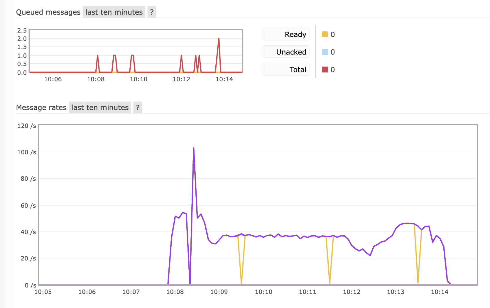
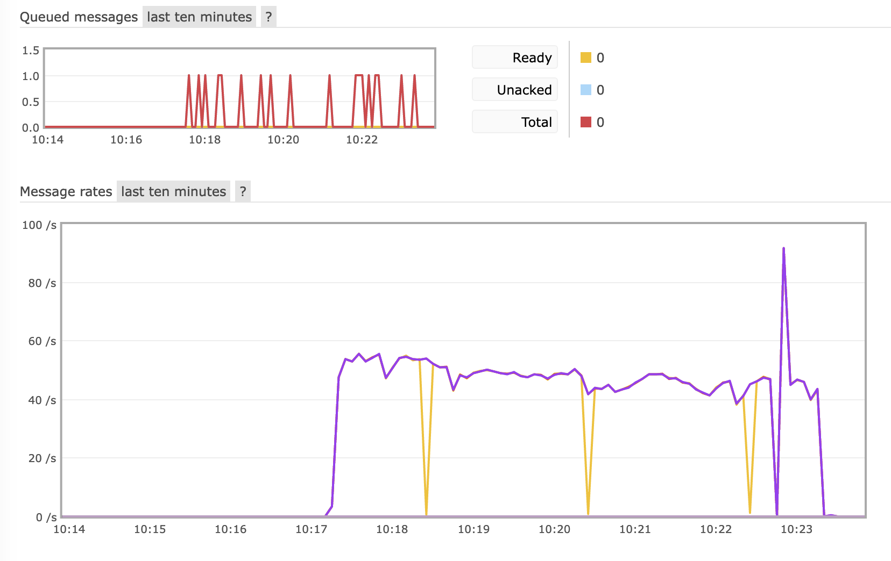

# FastAPI + RabbitMQ Demo

A simple demo of a producer + message broker + a consumer.

**Producer**: A FastAPI app that accepts a POST request with a JSON body and sends the message to RabbitMQ

**Message Broker**: RabbitMQ

**Consumer**: Reads from the RabbitMQ queue and writes the messages to a CSV file, where each item in `preds` should
correspond to its own row in the CSV file. That is, if you send 10 requests, and each message has 2 items in preds,
there would be 20 rows in the CSV file.

## Requirements

Developed and tested with:

- MacOS Ventura 13.1
    - Should work with Windows and Linux
- Docker
- Python 3.9
- Python packages listed in [requirements.txt](requirements.txt)

## How to Run

1. In terminal, run:
    ```shell
    # Set execute permission first
    chmod +x start.sh
    ./start.sh
    ```
   - Press `CTRL + C` to stop
2. Open another terminal instance and run locustfile.py to send 1000 randomly generated JSON body requests to the
   producer endpoint:
    ```shell
   python locustfile.py
    ```
3. To run a load test using [locust](https://locust.io/):
    ```shell
   locust --headless --users 3 --spawn-rate 1 -H http://0.0.0.0
    ```
4. The CSV file is located in the consumer's container at `/code/app/data.csv`


## List of API

### [1] POST: /api

**Input**

Request body:

```json
{
  "device_id": "string",
  "client_id": "string",
  "created_at": "timestamp",
  "data": {
    "license_id": "string",
    "preds": [
      {
        "image_frame": "base64 string",
        "prob": 0.41,
        "tags": [
          "string"
        ]
      }
    ]
  }
} 
```

Example request body:

```json
{
  "device_id": "h0A6",
  "client_id": "OdIj",
  "created_at": "2023-02-13 10:49:06.613585",
  "data": {
    "license_id": "license_OOYTh",
    "preds": [
      {
        "image_frame": "/9j/4AAQSkZJRgABAgAAZABkAAD/7AARRHVja3kAAQAEAAAARgAA/+4ADkFkb2JlAGTAAAAAAf/bAIQABAMDAwMDBAMDBAYEAwQGBwUEBAUHCAYGBwYGCAoICQkJCQgKCgwMDAwMCgwMDQ0MDBERERERFBQUFBQUFBQUFAEEBQUIBwgPCgoPFA4ODhQUFBQUFBQUFBQUFBQUFBQUFBQUFBQUFBQUFBQUFBQUFBQUFBQUFBQUFBQUFBQUFBQU/8AAEQgAggBqAwERAAIRAQMRAf/EAKAAAAIDAQADAQAAAAAAAAAAAAYHBAUIAwECCQABAAMBAQEBAAAAAAAAAAAAAAECAwQABQYQAAIBAgQDBAUKAgcGBwAAAAECAxEEACESBTFBBlEiEwdhcYEyFJGhsUJSIzM0FQjBcvBiQ1MkNRbR4YKSomNzg0RUJVYXEQACAgICAgICAQUAAAAAAAAAARECIQMxEkEEURNhsSJxgTIUBf/aAAwDAQACEQMRAD8Azn4rA90YBU8vLMBkcsEByilkZj4nyYBQF+qfD8QMqGtMKP4BISEE0XPswwp1llkKAafV2fRjgkWCSRJQQKnBkU6bi87pVslHDnxxyFZU1z9HPHCSfswPp7K4Icl10r0zvnWG/wBn0707ate7xfN4cMQoFAGbO7HJUUDUzHIDHHG2/LPyy2Lyj2+WPbXTcOsbpCm6dSOmlUTnDaahWOLPvH35DmctKqyhFOjiS63bp2y3far/AGe9U/pt3bTwTx5qoEkZzqM8idWXPBawCMHzw1N2nExZY2bzfbe2emoGnEVwo0FfP1SipVFGrnXBBBEsurB4/wDiM04CmWOGR56h3uxuY18JRqGdTxrhWMsIDpLoajQVz9mGSBKPZ9wqmnj2445tIj/EMHDLkeOCBuT2mvHnXS3tp2Y4DaOCq0hCoCWOQWmOF5LHa+nd63u72/b9psZry+3af4TbYIkJM8wIGlDwNCwr2c8cdBuzyp8otr8m9jkhunhu+udxjA3vdE+8WJCQRaW7Ur4akVdlzlf+qq04vTXgOIreOYofAuJakcUCrmfssQfmw6GeDl1Fdrte13M9ygQRxyt4SsPEKJGS1KAkZDBs8Ekp4Pnn+t9Jf/Wv7an5yb8l2f8Aj/8Ac9z/ALeJif3Dfyz8l+qPNKzm3xdwttm6fhle3+OulkkaWZFVmEcUaksAGFWJArlgQNLDXc/2ldQ+EP8AT/V+1bjd5A211HcWBIpXuuVlXjQd4qMGDnIqOrvJ/wAz+iBLcdQdO3cdjFqL7jbAXlloXixntzIijn3mGOYuYAZmkcitWxwJZ4EbuchWuOOyydabFvW4Xn6dt233F5uIFWtbWJ5pgAASSiAt82OgI8fL39qHW3VSre9RyDYbBlqkDATXj5GncB0py95q+jDKjYlrpB9H+0vbNr3SC1v7S/3PbZGZnuhcRxMiEigIRBnSuJtXVuMFk9dqc5Gl09+1Ty3S9hnG2TPbwBh8PczGYPq011EjPhl66Y1qiMfZjgsOlNp6T25p7SxhiuLKsW2xqijwvESjFMsqjI4S2DRpqmwWifw7iSZ5aSsw8SRdIZjwCKSDQA9nPEUbr5PN1Lu7RhbW6jtVauptBdh6SxNR7MO20JStW+JAzzCvf9M9D9S7zt2m8vbPbbkme6qwdpYzHVRUcNeqgPDEnA+yUvg+dNF7Twrz+XDGDBtL9re4w7z5bS7DG6puGx7jN4sIYGQwXgWWORl05KW1oMzXTjk8wXrUdTbdcxNR2VmOSqAKn6Bhh8HGaOaypP8AF6GBKjwxVS3ukBtS1/4a4jdFqfCQtuq/K3oDqmSeXdtmittxlzbcdvrZ3BlIpWTR3W7e8mMjvaj+Uafopf8ADON/5P8AlfsUCbhadOJfx7gVRWmJmignVQCvhk90vTV2E/Jh7+yowskNfpvtFngY3SYe0toLiKKGC3utBR4oVSQxAaCpKhTUEc8Nq32SXYXd6tez6obmxbZFfCIxSMLdgBG4Wh1/1jj0q2VlKPJvV1cM67zs1/ttlJPbR1lQGjkatLnPMcxhdjaWBtKq7RYqOnepo2tTFdL95EKMx7rgk1INcZNfsPhm/d6qTlHS+vIrqZGmlqpZUAbJaHmaenDPapAtbSwUM1tBaQ/4YLJPUorPl3qcSfWcB3SHSdnkp50QhWumMyiitEKUYj61By7MI7yaaqOBe+e822QeVG+7tfWzyarT4fbrZtICT3TLbiWmR1L4mWfbhuVJG/lSfP7w2/hhzF1HL5M9R7l0h5g2F7t8qm3uiLLeNsMqRNdWcrd4x+IQrSRGkqLUE6aDicdbOSlH1eTePg3c8Xi2UWt2XOSQaUCn65rypyxSWPicsgPHsNi58W6/Ud4uBp1IfEOWRQaQdCg8lAGIt1X9TQq3fiED+52U0ihdMMLd4KhQ1Cnlzy9uMG2xt1KDlt+z3s6x+K4jt1ykC+8rxmoNOYI+nLEKUdiu3YlwHNpt43CRdttNMTO1RKoA0lyK04ADjTGuq7ODG7dMsdez7Rb7VZW1jooqgIzHMh8ySf8Abj1aqFCPBvbtZstr3bVuYVh0gq4FcEXgSvU3Rm57Dc7nfM/ibeJDJbuvFIyBk3oBOPM2aXWbeD29XsrZFYyDgnmkjjUZlFVOFQWYjPGZS4ZocJslXGo27GQ0YUUKCK5ChGrOlK8caolZMswyje+RbvwW7qEEAc9JHE+k4g7QzTVSpKrzHfYtw6bG3X3iPC9GMcKoxdq1oSxoAKDhX0Y367Jo83fKM3f/AIz0f/c3H43j/jt+H9n+meL9UY/tsIbqKLwb+VKAgMaA5c8+OIms0r+3HzA2V9mPRHUN9Obu3DTbSEM3iiAZyQ0BKsqe+tMwKilBXErR5NWm1k4RpCN/g7RF2W0QC7U/4mYgysoHIE8/ScSeOEaU+zm7OEe13M8hluYvFOX3iMGdT/KafTiHVtlHsS4CvbNrhW0d/eaimmY7gzAINTkfmxsrrip599jdgi6U2Pw70XUiFoq/dvyzPo9OWG064cib9sqBswLCwSMUYFRX+qfXjWzzOSeIz4ahs2XKoPGmEnIQe6lsVv8Abdw22aqxXlvJEX5jWpHH0HPDWqrVj5G136WT+BQbX0ddbVaiC/lElwhp4qmrEVIBB9WeMWn1+qyz0/Y9lXc1Ryn2eaKRiEbv5UTvEDkADUfPij15kktqiCj3foq4uBJOJWidh92rAd3IAAkerC39XsNT3OmBSb9uF/bXEu17g9HtjSORBoqBwYVr2Yw/z1Whmy3TdWSi/WLn/wBx9XR7q+/9v3fe+bHofd+jyPo/Zlfri38LcHanvUNfRwwxVEXordN12nqHbr7ZLoWe7W06vY3BOSSHu94UNQwOll5g0wYkZOD6K9G7mvVmyW36pFHY79AuuWKI1AYjveGzLUjOnAZenCOs88lq7UuOGX9jCFuKSAS6ar4wGhwAa5lAPnGFpTIdlvgMrC2MYVkCFQe6WVmIFOB9HzY1pGF2kKdsaOMB1jC9gU0APPj/ABweBGy3srp43aRiACcxXtOObFaCiN9cYccxXE2ArdxT4k+Aq6mGQ9uGQDI/nH+6bYei7ibbej7GTqHctXwlrvEySjY5L5Jkhe2imj70rxKzOzL3DpKgk8IW3qXHjk0/U6r+WGwm8pG8w/MO/l3PqreIoNstYlZ7XbLVYLP4l8witJrkPdzNWwmnbe+XgtelKVwsjJ36yhsLZ4kd5ig7smRzHrxvR5zMveaVukdx8UjEShu9U17rdueMPs0lSbvW2NOBW+Mf+jXxPu9vqxLr+h5/YpvMW0UMkgy4jGknUAtpvn27cILuJgrxuGDnPTjkNzg3B+3/AK0k6qF60Eci7ftyiOa+lCoviMtdICljwzzwZE6NOB/bLaR3MnxM0wOpiFAA1af+WuDSvlnbNnhBPuKdRQWEk+w7Obx4UZ6SzCIMFHqqfkxS1muCeutbPLgzJ13+4Pzk6PEO5z7Ts9ts0Esf6tBapcX14luWpL4ZkaKPXGPtLSvHIYwL2LWt1eDZs1UpxLQzvKPzm643ybp218y7HbBt/UsUHw257WJ7Oexu7iIOkF3bXBcMrMfD8SNxRyKrTPDavY7W6k7a06dqyn8Gm9sleESWNy1ZIK0Y5VXkcbGjEVu8XKS2m7JG5DPaXEUTLkdZQgUPtwzWApRZSILpPyBPUm07dB1AbeDYtv8ACWG0gjVrmP4YDQqpIuiNlIBV9JPP0483/VTtPB6m32En8v5H7snTe2dO7RDtO1wC2sLYHRGDViTxaRzmzHmTxxvrVVUI8zZsdnLAbri5jgt2EC6QB6fXXtxaSPJljzPvZfgyYkOqRqAii5e3P5sZ9rUFtX+QCfpj/bP+WV/87t9358ZpRogU/mLHqszJ9k/wOLHUFGp7/HLkfRjmMuTT37Z+qEtdu3PYlVkWWZJzKV7rOy6dIaoqQFqR6RgRJ1nwzXHTd+ECzSTVBprYjKvOmLozWyOTp7eVlhCxmrAAVqQPbkcM8kzh1D5U9F9Vn4zcLHw71s2ubaRomfhmwGTcOeIX01tyaa+xZfkH9z8iOnxbwja5p0uFddL3MplSOMOrEquVHy7rcjiddFa8F6+2/KL693S4JKeMVuSgDS1/ulAzIzqSMabOCeqieSum3nwLe2keUNG76H094AsfewiuVvpbnAc7DcRPZRaVpQaQwFO7lT2DhirR5zmThvd8trG7htIAJ1HhQYKEZnLrTqi+6j3iTbrIstnbfmpypjQn7Irm3pphWx0hNdXbddblfQWsVToaoKJq9p45YhtUorqcMtP9P7p/dj8p4fujh2+vEvrY/dGYut72KezaPmTX5MPJaqFTlrIOQrmRywwqNH+Um5bc20wbfaRol6CJlhtg8vhqctc8xRV8RiD3ATpWnDhg+BLpzJo7pve7iJlguXVajuBaOxGGTEaGHs3WlptUqm5uhAAQA5PCvJhQ5HD9hHUb2zdV2l/BGfFWrAFWrnT1YYnDQTrcxzREqQQAeHPLAgImOub2ax3q1sI2McV3FLIZBzIYAj08TjPvs1B7f/O1qyb+AY3Pd7DarKSae7WCJBQO5CKrNlkBzJxj7wfQv1G1wNjpe+u7fpbabm+DLeS26yyRkaW0MKITWlKijUx6lG3VSfFezVV2WS+SN1PuUhtHHjQiendiLEllNMloCM/mw5lRnK+u91e6ufEigt5fEcCKSUyE55ZqKfTiLkqVa2d/NcK0xVixqUVqrSvLIfRgZODT9OX7J/L190fJhwQYH3/ab/wZJJHLBRwpxxlSPQ7pi+kBRyp5GmKEhk+XPX1t0zSyltpPBlzkMJJaR692q6lBNMu9UDsxyYXTsar6YnHUG2JuUUElhZ5aTK4Z39VAK59lcGCSwFXizGFomgSSI5eJJxoMEMIndIb02xbtrkvGnt3qq24yjRq8TyJzywKtJgalD42zf2ks1mmkW2Rj/atwWpzyxoTIPBH3a16d6p239M6htlurMMxSVi0bI+YqjDSRUZYS9FdQzTo9i+m01cCYu9mh6b6vtLT4v4vpyJ9dqRXW0aZpGdXOh01zx5/0db/g+pf/AE1s9dqP5DPg6tgvTLdXGhE0hYkYkUA7AOApj0kz5DYnIDdaeZdvZo0MF1Gty+VqhAhgr2O5BIPZ3hXAtaBa1koNqurq7t1uL+OZbt+8QJXK97iVzpQ+gnCLIWoLO2treacOQwdSKCQAivrp/HDChh8F/L+Xpy4YaTjD+9WkLxSAIOBxmk1QZ93uAwbjMhyAY5HHIa3JwtXkjYMjlCPrLkR6scPWTYHk9Ld7htEd/u93I8vhRQ2kLVENlZxLQaiw+8mlprY8vpZIhdqR3bft9jcJknjJ2tU19mGVULJG6i6YgntQ1sCbqJlkgSMlY1ZM1LEEE0IrStPTgWqdV5KaDzQ3HYkj2u/AnkRQGu6aXkf6zkEEKo4ClKnhwrhPsjA71p5ClPMC93C2jFtbSXE7mgNRkSK5lqcKjFe8irWp5PZtlh3Ol91DIsslKRW6MaRE0BIORqfRiNnLPT1dUoRF3fath2+ze5+IuY1jGomW4fSe0KCcMlBl228IXtvt0HU26eDt6+LYIS05yYGhyBNcBZZlagaFjtgtbdbWHKMAKI6kU9VOHsxZEwn2jb4wAxzBHe1DMevBFCT9NtfR+HXnjhTCu7qvhtpocs6duII1SZ76ui8Pdpq5Vb6cGCkyVFuFUeLL7nBVBprPrHAduAxlIfdH9d77ttwltcsLjZ1ZGlglZkgUKdROWZNOWeQ9uFmA2qrGkfLLzHvurFluGmFvaxN4aoO6XQcHZRWhY10oCaLQk14OrMhasDtsLpZ0zb6oJrwPIDFExGgd6h6OtdzleVB98xBcrkMsTtWSisAc8m+dP3BgQ0DPqDnkMSbdSmGWtj5iXcULxzgySZhdWfHKtcFbAQysveoN86oMdlIAKnSNPDTXAdnYHWBn9EdMw7TZASKVlYatQqK4vRQQsF0NnI8isYwB2rzw4oS2tpBEisDpl+sDzwRTtoPo4446WYP3BSiPXgcQNDEV1xD/APLMFp3qccEfwDiBHYvKdNtH3cqVPYq15nAYyaJkt2zW66uElVjiUkBYlPAVP1jxPE0wEsju2BqeSG6iPcpLZrkVNJEgd1UAjIkKKFjSmCyVjV+27q0MQDhtROoADIKBlWuB2gESXUG764Wl1FUBooI948zgqwXUh3u2RbmnfAL8XbsrwHrwHDDwDM/R6CYrD3wTQc6nniTqMmEvTPS8dnL41ygqO6D2HFKVgSzGJHI0gEKxgitOGRxdsgixtbeW2Okk6DmB2eg4CZzyT0kIb76unkDgitHXX9H/AE4IuTAfUm5mBM6KvbjO3BrrWRJ9U3LXl9qVhmdII5duCnI7UA3JJUhVHcTJB6OZ9ZwyJNky1srjcmVLOJpWiQa40GpgKmpoPScGA9ki2faOpOlJYd6jhltTGPGtL3QdIatMmIIqOGk4LQvY+iGz7FZ7n01t2/KGSO6toriav1WdRqqOzVXCumAVtktI+lFcJLFSSMCoUfxxPqWVjtHsMzVGgRqCfTjkjmT4unRRJEX7wZj1DDwK2TrfZJnaipUHjX144VhBY9OSxffatUnIGvZwwVIja4Li229f/UAavowwjPS4sKtpYZjNQOGCcRfh2+xypgnQfPnqPam3GLQVrpNcRak0K7q8Ck6t2B7BfGVSF4e3246IGTlAQwFSTx4154cixtft62t7nzM2eG5gEu3XOpblHBKvBqCvpI5qWXBQtuDbFl5V2CbNc9N7oi31qkkwtpXA1GJ9WXyUxSCXgY3Se0Cz6Us9tlzSGEQ8OQywPA65PPTIubdZLTcIgrxsyLICCjKDQHLtxNFWX5s4XbuUKHnSnyY4J1isolK6c3J7xpy4AYEnZJsMS2pIlov2R6+GOAyUlytCNWVARhpJtEWSaQsZGzjOQIwJDBHubxyVkZeHu05YMgg4/qbfYX/fg9hYMK3HvN/LiZZCz8w/8vfhx544pXyJh/ewxK3Jp/8Aal+N/Z/nJPxPe/Dj/D9H2vTh6krcm33/ADFv/O3u/wAp4+jDsCLfb/8AKl9Q4YD4GXIPJ/mN373v8uHHniJdBVt/4Z48Dx4+zA8nE+H8ynD+lMBcgZ67n+Lz4j3uOBY6pwbl7PXywxx0+qeHA8Pd4nBEIV9+EPe93lwxwCr+X3cKMf/Z",
        "prob": 0.14,
        "tags": [
          "low_prob"
        ]
      }
    ]
  }
}
```

**Output**

Response:

```json
{
  "status": "received"
}
```

## Findings

Using locust, I experimented with using a single threaded and multithreaded consumer.

The multithreaded version consistently achieved higher message rates of 45-55/s than the single threaded version that averages at 38/s





## References & Credits

1. [My own GitHub repo that uses FastAPI](https://github.com/adibyhy/url-shortener-fastapi)
2. [FastAPI documentation](https://fastapi.tiangolo.com/)
3. [Pydantic documentation](https://docs.pydantic.dev/)
4. [Pika repo](https://github.com/pika/pika/tree/main/examples)
